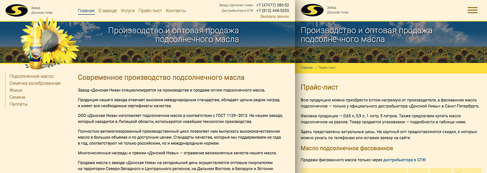
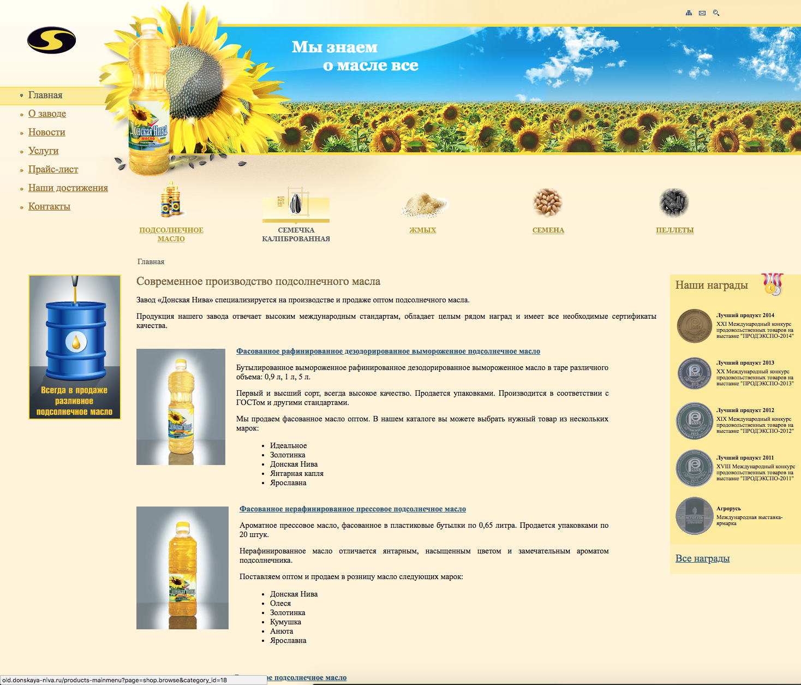
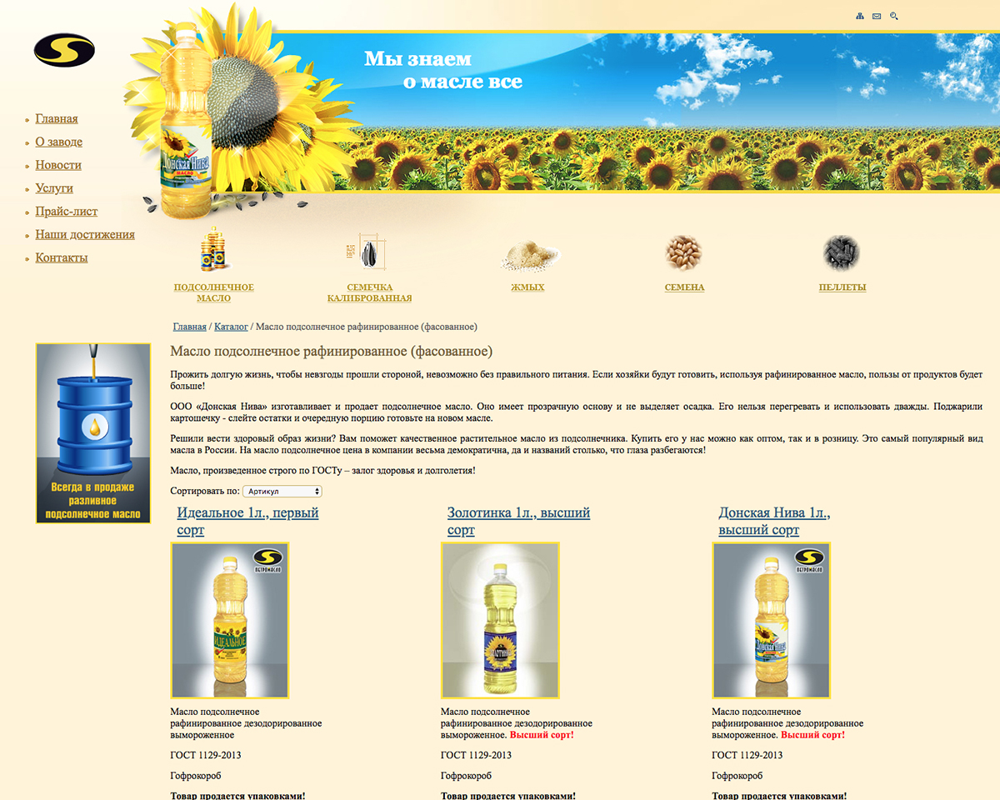

# Редизайн сайта DONSKAYA-NIVA.RU

  

[https://donskaya-niva.ru/](https://donskaya-niva.ru/)

<small>Проектирование, Редизайн, Front-end, Back-end</small>

## В работе использовал
 
CMS Joomla 3, Gulp, SASS, Bootstrap 3, БЭМ, jQuery, Ajax, PHP

## Основные причины редизайна

* Первую версию сайта сделал в 2008 году, на CMS Joomla – за это время дизайн устарел.
* Сайт не адаптировался под мобильные устройства.
* Контент дублировался из-за проблем в каталоге, из-за чего 40% страниц сайта не попадало в индекс поисковых системам.
* Из-за ошибок проектирования в прошлом, CMS было невозможно обновить без значительных трудозатрат. Это привело к проблемам с безопасностью и невозможности эффективно продвигать сайт. 

Поэтому, чтобы не изобретать очередной костыль – сделали новую версию сайта.

> Проектируя сайт взаимодействовал с интернет-маркетологом, отвечающий за продвижение сайта.

## Что сделал

* Хотелось сохранить черты предыдущего сайта, поэтому решил сделать редизайн, оглядываясь на оригинал. Макет дизайна сделал самостоятельно в Adobe XD.
* При верстке использовал `Bootstrap 3`, `SASS`, `БЭМ`.
* Сайт адаптируется под разрешение экрана.
* Интегрировал верстку с `CMS Joomla 3.8` не затронув ядро – обновлять CMS теперь можно без проблем.
* Контент на сайте редактируется в административном разделе – меню, объявление, телефоны, награды, сертификаты, новости, каталог, статичные разделы.
* В каталоге теперь нет отдельных страниц под каждый вид продукции, описание которых отличались только названиями, из-за чего каталог индексировался с проблемами.
* Добавил призывы к действию: заказать обратный звонок, запросить оптовый прайс, получить скидку, написать сообщение.
* В .htaccess настроил 301 редиректы: на новые URL, удаление www у домена и слеша в конце URL.
* Настроил веб-аналитику.

## Сайт до изменений
  

