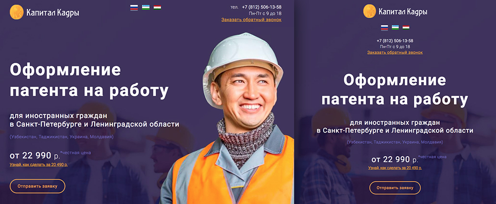

# Посадочная страница по патентам на работу

[http://patent.guestworkers.ru/](http://patent.guestworkers.ru/)

_Front-end, Back-end_

  

## В работе использовал
 
* Front-end: Gulp, Avocode, HTML, CSS, SASS, Bootstrap 3, БЭМ, jQuery, Ajax
* Back-end: PHP

_В src лежат примеры c исходным кодом._

## Описание задачи

* **Сделать адаптивную верстку** полученного веб-дизайн. 
* **Сделать калькулятор** стоимости нового и продление старого патента.
* **Сделать формы** для отправки заявок с сайта.
* **Сделать выбор языка**.

## Что сделано
    
* **Верстка** – HTML, CSS, SASS, Bootstrap 3, БЭМ, jQuery, Gulp, Avocode

    Для реализации адаптива использовал `Bootstrap 3` и собственную разметку на медиа запросах. Макет дизайна был без адаптивной разметки, продумывал самостоятельно.
    
    Использовал `Avocode` для ускорения работы с макетами PSD. В сложных случаях переключался в Photoshop.
    
    HTML и CSS код организовал используя методологию `БЭМ`.
    CSS писал используя препроцессор `SASS`.
    Использовал семантическую разметку. 
    
    Для реализации форм использовал модальные формы Bootstrap: 
    * заказать обратный звонок, 
    * отправить заявку, 
    * получить скидку, 
    * написать сообщение.
    
    На `JavaScript` и `jQuery` реализовал:
    * Калькулятор расчета стоимости нового и продление старого патента на работу.
    * Валидацию форм.
    * Плавный скролинг до якоря и верха страницы.
    * Блок «Как оформить патент» с табами.
    
    Использовал `Gulp` для генерации CSS из `SASS`, добавления вендорных префиксов, склейки и минификации CSS и JS, авто перезагрузки страницы при верстке, оптимизации изображений. 

* **Back-end, обработка отправки сообщений с форм** – PHP

    Обмен форм с сервером реализован на Ajax в формате JSON.
    
* **Прочее**

    Настроил веб-аналитику – отправка событий о достижении цели в Яндекс.Метрику после фактической отправки сообщений с форм и коллтрекинг.    