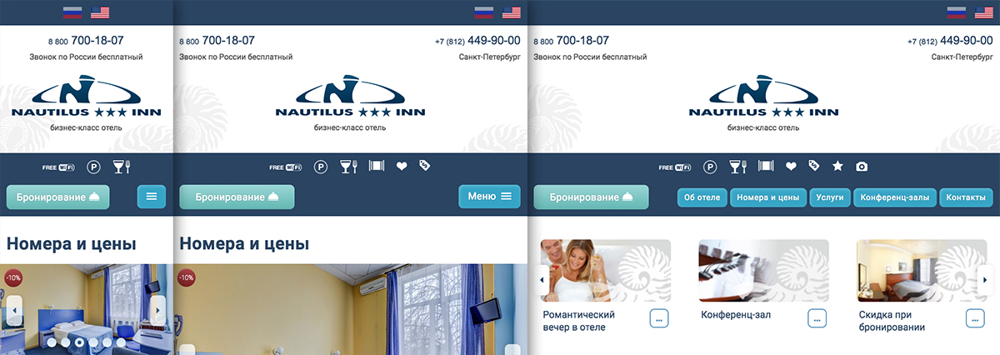

# Мобильная версия сайта NAUTILUS-INN.RU

`2018` [https://nautilus-inn.ru](https://nautilus-inn.ru)

_Проектирование, Front-end, Back-end_

  

## В работе использовал
 
* Front-end: Gulp, Avocode, HTML, CSS, SASS, БЭМ, jQuery, Ajax
* Back-end: 1C-Bitrix, PHP, MySQL

_В src лежат примеры c исходным кодом._

## Описание задачи

Есть основной сайт на `CMS 1С-Битрикс`, с фиксированной версткой.

Требовалось:
* Разработать отдельную версию основного сайта для работы на мобильных устройствах: смартфоны и планшеты.
* Основной сайт должен остаться как есть. 
* Верстка мобильной версии должна быть адаптивной.
* Мобильная версия сайта должна работать на том же ядре 1С-Битрикс, что и основной сайт.
* Контент основного сайта должен быть связан с мобильной версией, т.е. весь контент должен редактироваться в одном месте.
* Структура разделов должна быть единой.
* Оба сайта должны работать на основном домене, без поддоменов.

## Что сделано

* **Проектирование**

    Совместно с маркетологом и дизайнером спроектирован и разработан веб-дизайн основных страниц сайта: главная, список номеров и подробное описание номера, акции, услуги, тарифы, типовая текстовая страница и пр.
    
* **Верстка** – HTML, CSS, SASS, БЭМ, jQuery, Gulp, Avocode

    Для реализации адаптива разработал свою разметку на медиа запросах, учитывающую отображение сайта на:
    * смартфоне в вертикальной ориентации (<568px),
    * смартфоне в горизонтальной ориентации (>=568px <979px),
    * планшете в вертикальной ориентации (>=568px <979px),
    * планшете в горизонтальной ориентации (>=979px).
    
    Использовал `Avocode` для ускорения работы с макетами PSD. В сложных случаях переключался в Photoshop.
    
    HTML и CSS код организовал используя методологию `БЭМ`.  
    CSS писал используя препроцессор `SASS`.  
    Использовал семантическую разметку. 
    
    Переделал верстку контента основного сайта для адекватного отображения на основной и мобильной версии сайта.
    
    На `jQuery` реализовал:
    * Навигацию по сайту.
    * Слайдеры номеров, спецпредложений, отзывов, конференц-залов. Использовал скрипт [https://github.com/kenwheeler/slick](https://github.com/kenwheeler/slick). 
    * Подгрузка отзывов по нажатию на кнопку "Показать еще" без перезагрузки страницы.
    
    Использовал `Gulp` для генерации CSS из `SASS`, добавления вендорных префиксов, склейки и минификации CSS и JS, авто перезагрузки страницы при верстке, оптимизации изображений. 

* **Back-end, определение мобильного устройства** – 1C-Bitrix, PHP

    Для мобильной версии добавил отдельный шаблон сайта, который подключается при условии, что сайт открывается на мобильном устройстве. 
    
    Определение мобильного устройства реализовано на PHP библиотеке `Mobile_Detect` ([https://github.com/serbanghita/Mobile-Detect](https://github.com/serbanghita/Mobile-Detect)).
    
    Чтобы подключить мобильный шаблон использую `PHP выражение` в настройках сайта – шаблон подключится, если PHP выражение вернет `TRUE`. Но библиотека `Mobile_Detect` требует создания экземпляра класса, а в PHP выражении этого не сделать. Для обхода этого ограничения написал свой класс наследник от Mobile_Detect с паттерном `Singleton`.
    
    ```php
    class MobileDetected extends \Mobile_Detect
    {
        private static $instance = null;
    
        public static function getInstance()
        {
            if ( is_null( self::$instance ) ) {
                self::$instance = new self();
            }
    
            return self::$instance;
        }
    }
    ```
    
    Расширил метод библиотеки `Mobile_Detect::isMobile()` для работы с `cookie`:
    
    ```php
    /**
     * @param null $userAgent
     * @param null $httpHeaders
     * @return bool
     */
    public function isMobile( $userAgent = null, $httpHeaders = null )
    {
        if ( isset( $_COOKIE[ 'mobile' ] ) ) {
            if ( $_COOKIE[ 'mobile' ] == 'Y' ) {
                setcookie( 'mobile', 'Y', time() + 3600 * 24, '/' );
                return true;
            }
            setcookie( 'mobile', 'N', time() + 3600 * 24, '/' );
            return false;
        }

        if ( parent::isMobile( $userAgent, $httpHeaders ) ) {
            setcookie( 'mobile', 'Y', time() + 3600 * 24, '/' );
            return true;
        }

        setcookie( 'mobile', 'N', time() + 3600 * 24, '/' );
        return false;
    }
    ```
     
    В `init.php` добавил автозагрузку нового класса:
    
    ```php
    Loader::registerAutoLoadClasses( null, array(
        'Nautilus\Classes\Helpers\MobileDetected' => '/local/php_interface/classes/helpers/MobileDetected.php'
    ) );
    ```
    
    У мобильного шаблона в настройках сайта прописал PHP выражение:
    ```php
    Nautilus\Classes\Helpers\MobileDetected::getInstance()->isMobile()
    ```
    
    У компонент добавлен отдельный шаблон для вывода мобильной верстки, который подключается следующим образом:
    
    ```php
    $isMobile = Nautilus\Classes\Helpers\MobileDetected::getInstance()->isMobile();
    $template = ( $isMobile ? 'mobile_rooms' : 'rooms' );
  
    $APPLICATION->IncludeComponent(
        "bitrix:news",
        $template,
        array(
            "IBLOCK_TYPE" => "content",
            "IBLOCK_ID" => "5",
            "NEWS_COUNT" => "20",
            "USE_SEARCH" => "N",
            
            ...
            
        ),
        false
    );
    ```